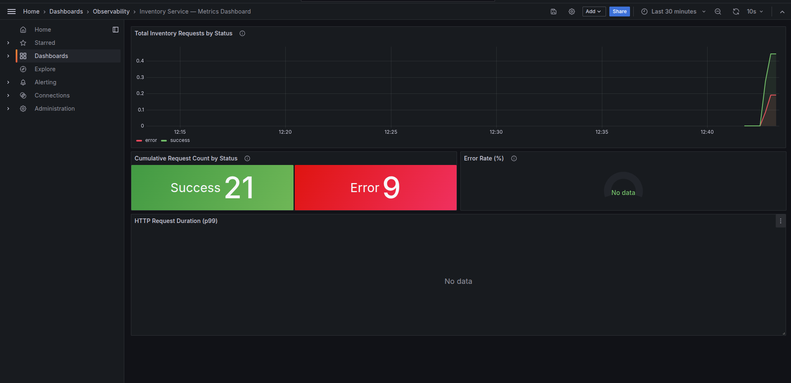
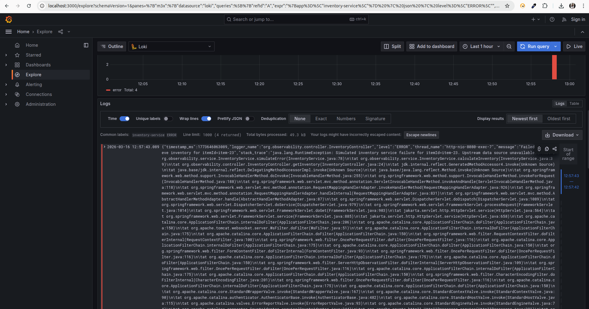
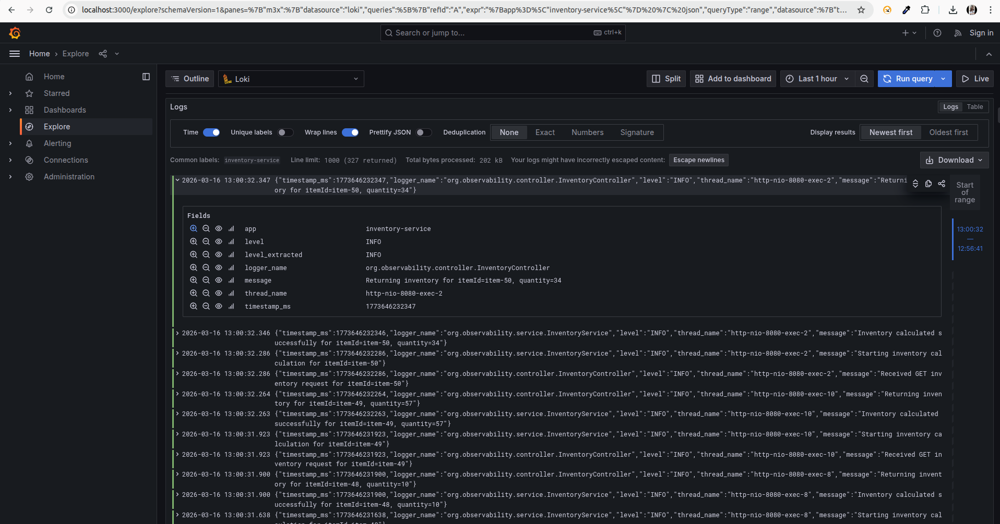
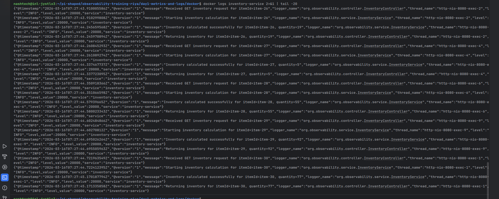

# Day 1 — Logs & Metrics Foundation
---

## Project Overview

A Spring Boot inventory service demonstrating **structured logging** and **custom metrics** as the foundation of observability. The service exposes a REST API with `{itemId}` path variable, simulates realistic traffic with random delays and random HTTP 500 errors, and pushes structured JSON logs to **Loki** and metrics to **Prometheus**, both visualized in **Grafana**.

### Error Scenarios Simulated

- **Random delay**: Every request sleeps between 50ms–500ms to simulate real processing latency
- **Random HTTP 500**: ~20% of requests throw a `RuntimeException`, returning HTTP 500 and incrementing the `error` counter

---

## Architecture

```
HTTP Request
     │
     ▼
┌─────────────────────────┐
│   inventory-service     │   Spring Boot 3 on :8080
│   - REST API            │
│   - Custom Counter      │
│   - JSON Logging (SLF4j)│
└────┬──────────┬──────────┘
     │          │
     │ scrape   │ loki4j push
     ▼          ▼
Prometheus    Loki
  :9090        :3100
     │          │
     └────┬─────┘
          ▼
       Grafana
        :3000
```

---

## Key Implementation Details

### Custom Counter with Dynamic Status Tag

```java
Counter.builder("inventory.requests.total")
    .description("Total number of inventory requests")
    .tag("service", "inventory-service")
    .tag("status", "success")   // or "error"
    .register(meterRegistry);
```

Every call to `calculateInventory()` increments either the `success` or `error` counter depending on the outcome. This satisfies the requirement for a dynamic `status` tag.

The metric is exposed at `/actuator/prometheus` as:
```
inventory_requests_total{service="inventory-service", status="success"} 14.0
inventory_requests_total{service="inventory-service", status="error"}   3.0
```

### Structured JSON Logging

`logback-spring.xml` uses `LogstashEncoder` to output every log line as a JSON object:
```json
{
  "@timestamp": "2026-03-16T10:30:00.000Z",
  "level": "ERROR",
  "message": "Error calculating inventory for itemId=item-3",
  "service": "inventory-service",
  "stack_trace": "java.lang.RuntimeException: Simulated..."
}
```

Custom log statements at each level are placed throughout the service:
- `INFO` — request received, result returned
- `DEBUG` — delay simulation details
- `ERROR` — exception with full stack trace

---

## Running Tests

Tests cover:
- `InventoryServiceTest` — unit tests verifying counter increments for success and error paths
- `InventoryControllerIntegrationTest` — integration tests verifying HTTP endpoints and Prometheus metric exposure

---

## Visual Proof (Screenshots)

### 1. Custom Prometheus Counter in Grafana Dashboard

The dashboard shows the `inventory_requests_total` counter grouped by the `status` tag (`success` in green, `error` in red). This is the custom dimensional metric injected via `MeterRegistry` in `InventoryService`.



---

### 2. Structured JSON Logs in Grafana Loki (Explore View)

The Loki Explore view shows structured JSON logs from `inventory-service`. Each log line is a complete JSON object including `level`, `message`, `service`, and full `stack_trace` for errors. The `ERROR` level logs are clearly visible from the simulated failures.






---

### 3. Raw JSON Logs in Terminal

The console output shows raw structured JSON logs exactly as produced by `LogstashEncoder`, confirming the format before they are shipped to Loki.



---