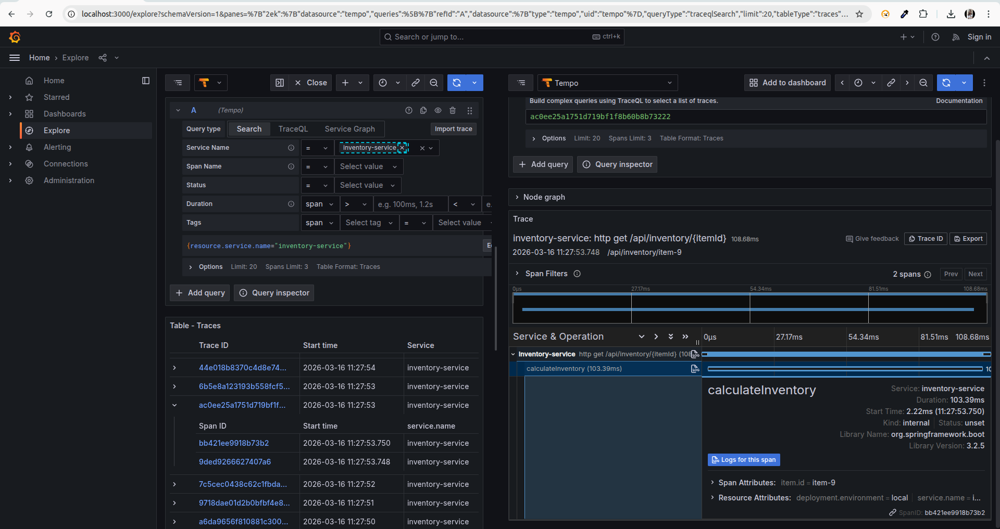
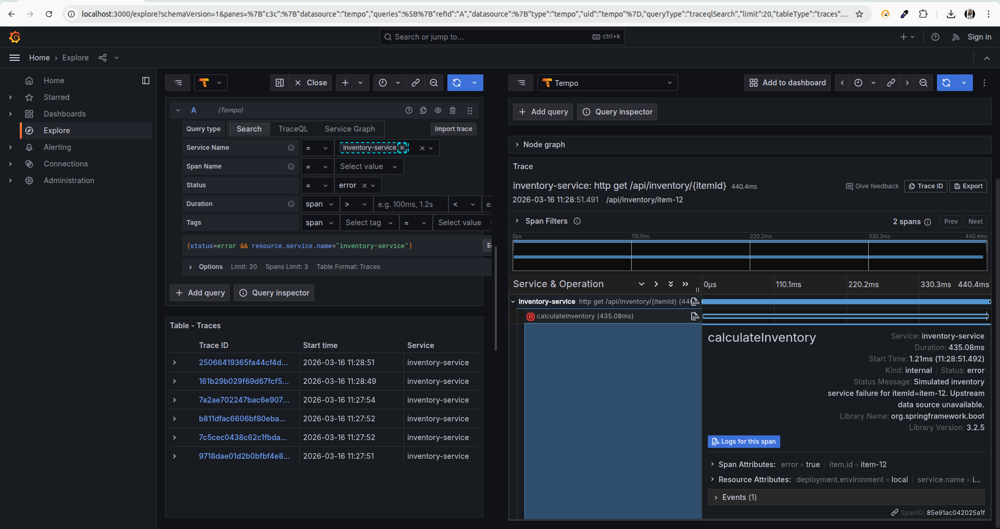
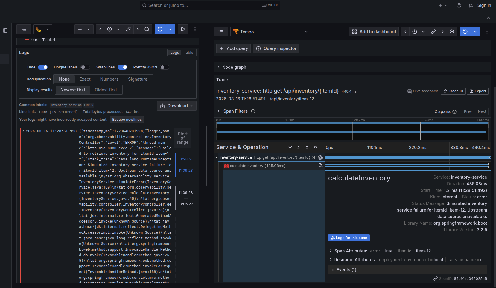

## Traces & Screenshots for the implementation

### 1. Grafana Tempo — Gantt Chart with Custom Nested Span

The screenshot below shows the full request lifecycle in Grafana Tempo for a `GET /api/inventory/{itemId}` request. The Gantt chart shows two spans:

- **Parent span**: `http get /api/inventory/{itemId}` — the top-level HTTP request span created automatically by Micrometer
- **Child span**: `calculateInventory` — a **custom nested span** created manually inside `InventoryService.calculateInventory()` using the Micrometer Tracing API

The `calculateInventory` span includes the custom attribute **`item.id = item-9`**, which is populated from the `{itemId}` path variable, satisfying the custom span attribute requirement.

---

### 2. Failed Span — HTTP 500 Error Trace (Red Span)

The screenshot below shows a trace where the `calculateInventory` span has **failed** (shown in red with `●`). This was triggered by the random error simulation in `InventoryService.simulateError()`, which throws a `RuntimeException` with ~20% probability.

The failed span shows:
- **Status: Error**
- The full **Java exception stack trace** attached to the span
- The span is visually marked **red** in the Tempo Gantt chart, making it easy to identify failure points during root cause analysis

---

### 3. Log–Trace Correlation (Loki + Tempo)

The screenshot below demonstrates **Log–Trace Correlation** — the integration between Day 1 (structured JSON logging) and Day 2 (distributed tracing).

The **left pane** shows a Loki `ERROR` log line from `inventory-service`. Because `logback-spring.xml` uses `LogstashEncoder` with MDC injection, every log line automatically includes `traceId` and `spanId` fields populated by Micrometer Tracing.

The **right pane** shows the **exact same request** opened in Grafana Tempo using the `traceId` from the log. The `calculateInventory` span is visible in red, confirming it is the failed trace that produced the error log.

This proves end-to-end correlation: a single `traceId` links the log entry in Loki to the full distributed trace in Tempo.

